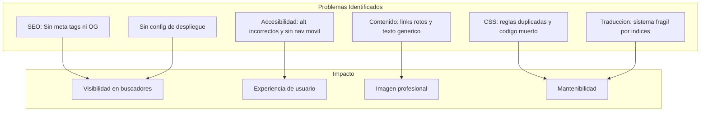

# Plan: Mejoras al Portafolio Profesional

## Contexto

Tu portafolio es un sitio estatico vanilla (HTML/CSS/JS) de una sola pagina con soporte bilingue (EN/ES). Visualmente es atractivo (dark mode, glassmorphism, animaciones), pero tiene varios problemas tecnicos y de contenido que limitan su efectividad profesional.

### Estructura actual

```
portafolio profesional/
├── index.html        (entrada principal, todas las secciones)
├── script.js         (~476 lineas: traducciones, parallax, particulas, modales)
├── style.css         (~1616 lineas: CSS custom, responsive)
└── assets/           (5 imagenes de proyectos)
```

### Hallazgos clave



---

## Problemas Detallados y Soluciones

### 1. SEO y Meta Tags (Prioridad Alta)

**Problemas:**

- Sin `<meta name="description">`
- Sin Open Graph tags (cuando compartes tu link en LinkedIn/WhatsApp se ve generico)
- Sin favicon
- Sin `robots.txt` ni `sitemap.xml`
- Sin structured data (JSON-LD)

**Solucion:** Agregar en `<head>` de index.html:

```html
<meta name="description" content="Roberto Cuevas - Full Stack Developer specializing in Python, AWS, and scalable backend solutions. 3+ years of experience.">
<meta property="og:title" content="Roberto Cuevas | Full Stack Developer">
<meta property="og:description" content="Building scalable digital solutions for modern businesses">
<meta property="og:image" content="URL_DE_TU_OG_IMAGE">
<meta property="og:type" content="website">
<link rel="icon" href="assets/favicon.ico">
<link rel="canonical" href="https://TU_DOMINIO.com">
```

---

### 2. Accesibilidad y Navegacion Movil (Prioridad Alta)

**Problemas:**

- La navegacion se oculta completamente en movil (`display:none` en `<768px`) sin alternativa
- Todas las imagenes de proyectos tienen `alt="Agendly SaaS"` (copy-paste error)
- Modal sin `role="dialog"`, sin focus trap, sin `aria-modal`
- Sin `<main>`, sin skip-to-content link
- Botones de idioma y resume sin `aria-label`

**Solucion:**

- Agregar hamburger menu con animacion CSS para movil
- Corregir cada `alt` con descripcion real del proyecto
- Agregar semantica ARIA al modal y focus management
- Envolver contenido en `<main>` y agregar landmark roles

---

### 3. Contenido y Copy (Prioridad Alta)

**Problemas:**

- Links de contacto apuntan a `href="#"` (email, LinkedIn, GitHub no funcionan)
- Boton "Resume" no enlaza a ningun PDF
- Parrafo del hero demasiado largo (\~80 palabras)
- Experiencia sin metricas cuantificables ("redujo tiempo de procesamiento en X%")
- Palabra "scalable" y "modern" repetidas excesivamente
- Typo en URL de GitHub: `NKJContruction` (falta la 's' en Construction)

**Solucion:**

- Reemplazar `href="#"` con URLs reales (tu email, linkedin.com/in/TU\_PERFIL, github.com/TU\_USER)
- Subir tu CV en PDF a `assets/` y enlazarlo
- Reescribir hero a 2 oraciones directas
- Agregar numeros a la experiencia ("Automatice X procesos, reduciendo tiempo en Y%")
- Corregir URL del proyecto NKJ

---

### 4. Limpieza de CSS (Prioridad Media)

**Problemas:**

- `.modal-content` definido con mismos valores en 3 media queries
- `.project-image` definido 3 veces (lineas 473, 1381, 1414)
- `.section` definido 2 veces (se sobreescribe)
- Bloques comentados extensos (cursor custom, old about section)
- \~1616 lineas sin organizacion clara

**Solucion:**

- Eliminar todo codigo comentado
- Consolidar reglas duplicadas
- Organizar CSS en secciones con comentarios claros: variables, base, layout, components, utilities, media queries

---

### 5. Sistema de Traduccion (Prioridad Media)

**Problemas:**

- La traduccion usa `querySelectorAll` con indices numericos (linea \~230-340 de script.js)
- Si agregas un elemento al nav, todos los indices se desplazan y las traducciones se rompen

**Solucion:**

- Migrar a atributos `data-i18n="hero.title"` en HTML
- Usar un objeto plano de traducciones en JS
- Iterar todos los `[data-i18n]` y asignar el texto correspondiente

---

### 6. Configuracion de Despliegue (Prioridad Baja)

**Problemas:**

- No hay forma automatizada de desplegar
- Sin minificacion de CSS/JS
- Sin cache-busting

**Solucion minima:**

- Crear un archivo para GitHub Pages (simplemente push a branch `main` con GitHub Pages activado)
- O un `vercel.json` / `netlify.toml` para deploy automatico
- Opcionalmente, agregar Vite como bundler para minificacion

---

## Verificacion

Despues de implementar:

1. Correr Lighthouse en Chrome DevTools (target: >90 en SEO, >90 en Accessibility)
2. Verificar OG tags con [opengraph.xyz](<> "https://opengraph.xyz")
3. Probar en movil real que el menu hamburguesa funcione
4. Verificar que todos los links de contacto abran correctamente
5. Validar HTML con W3C Validator

## Archivos Criticos

- index.html - Estructura HTML, meta tags, contenido, semantica
- style.css - Limpieza CSS, hamburger menu, reglas duplicadas
- script.js - Sistema de traduccion, hamburger toggle, modal accessibility
- assets/ - Agregar favicon, OG image, PDF del CV

---

## Resumen de Impacto Esperado

| Mejora             | Antes              | Despues                    |
| ------------------ | ------------------ | -------------------------- |
| SEO Lighthouse     | \~50-60            | 90+                        |
| Accesibilidad      | \~60               | 90+                        |
| Nav movil          | No existe          | Menu hamburguesa funcional |
| Links contacto     | Rotos (#)          | Funcionales                |
| Mantenibilidad CSS | Baja (duplicados)  | Alta (organizado)          |
| Traducciones       | Fragiles (indices) | Robustas (data-i18n)       |
